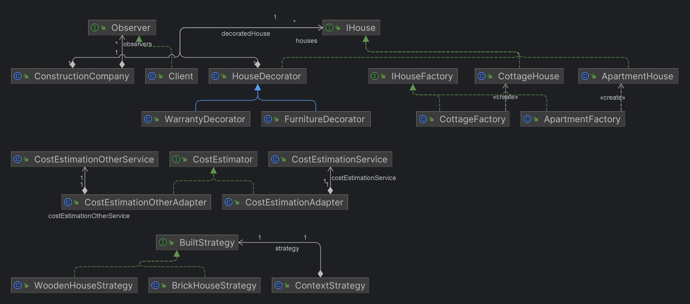
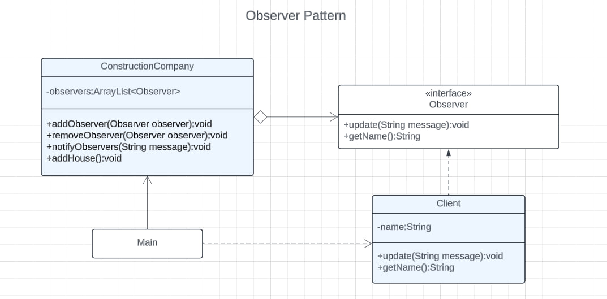
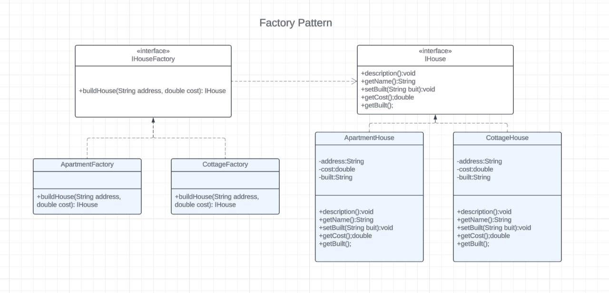
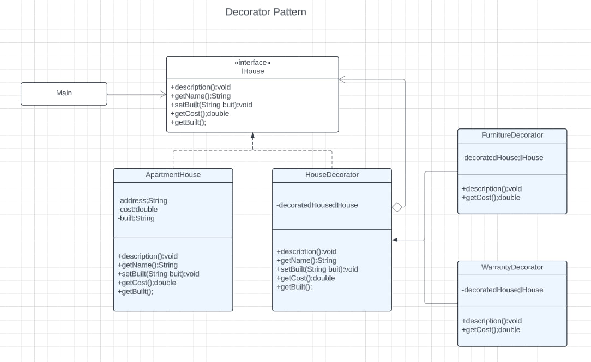
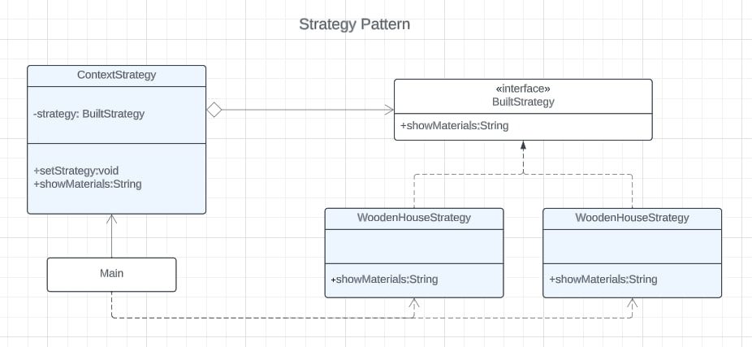
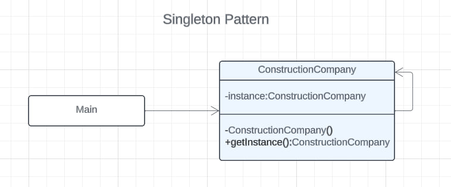
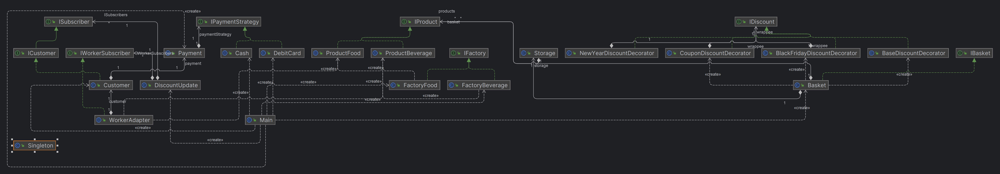

# Software Design Patterns Final Project | Construction Company

#### Group: SE-2216

#### Team members: Kuanysh Kambarov, Rakhat Bakhytgali, Maxim Turbulyak

### Project Overview
- This project demonstrates the application of various design patterns in a Java-based construction company application.
- Idea of project is to create a construction company application that manages houses and observers (clients).
- Purpose of project is to implement learned design patterns in a real-world application.


UML Diagram of the Design Patterns used in this project

## Installation
- Required JDK 21.0.1
- Open terminal
- `git clone https://github.com/kfcboxmaster/SDPFinal/`
- `cd SDPFinal`
- `Open in IntelliJ IDEA`
- `Run Main.java`

## TODO:
- [x] Create UML Diagram
- [x] Create README.md
- [x] Create Singleton Pattern
- [x] Create Factory Pattern
- [x] Create Decorator Pattern
- [x] Create Strategy Pattern
- [x] Create Observer Pattern
- [x] Create Adapter Pattern
- [x] Create Faced Problems Document


## Adapter Pattern


The Adapter pattern is a structural design pattern that allows objects with incompatible interfaces to collaborate. It's often used when you want to make your existing classes work with others without modifying their source code.

In this project, the Adapter pattern is used to adapt the interface of a third-party `CostEstimationService` to the `CostEstimator` interface used in the application.

```java
public interface CostEstimator {
    double estimateCost(IHouse house);
}

public class CostEstimationAdapter implements CostEstimator {
    private CostEstimationService costEstimationService;

    public CostEstimationAdapter(CostEstimationService costEstimationService) {
        this.costEstimationService = costEstimationService;
    }

    @Override
    public double estimateCost(IHouse house) {
        String houseBuilt = house.getBuilt();
        double baseCost = house.getCost();
        return costEstimationService.estimateCost(houseBuilt, baseCost);
    }
}
```

## Observer Pattern



### Structure
- **ConstructionCompany - Publisher**
- **Observer - Subscriber**
- **Client - Concrete Subscriber**
- **Main - Client**

The Observer pattern is a behavioral design pattern that lets you define a subscription mechanism to notify multiple objects about any events that happen to the object they're observing.

In this project, the Observer pattern is used to notify `Client` objects about updates in the `ConstructionCompany`.

```java
public interface Observer {
    void update(String message);
    String getName();
}

public class Client implements Observer{
    private String name;
    public Client(String name){
        this.name = name;
    }
    @Override
    public void update(String message){
        System.out.println(name + " was updated about: " + message);
    }
    @Override
    public String getName(){
        return name;
    }
}
```

## Factory Pattern



### Structure
- **IHouseFactory - Creator**
- **ApartmentFactory - ConcreteCreatorA**
- **CottageFactory - ConcreteCreatorB**
- **IHouse - Product**
- **ApartmentHouse - ConcreteProductA**
- **CottageHouse - ConcreteProductB**

The Factory Method pattern is a creational design pattern that provides an interface for creating objects in a superclass, but allows subclasses to alter the type of objects that will be created.

In this project, the Factory pattern is used to create different types of `IHouse` objects.

```java
public interface IHouseFactory {
    IHouse buildHouse(String address, double cost);
}

public class ApartmentFactory implements IHouseFactory{
    @Override
    public IHouse buildHouse(String address, double cost){
        return new ApartmentHouse(address, cost);
    }
}
```

## Decorator Pattern



### Structure
- **IHouse - Component**
- **ApartmentHouse - ConcreteComponent**
- **HouseDecorator - BaseDecorator**
- **FurnitureDecorator, WarrantyDecorator - ConcreteDecorators**
- **Main - Client**

The Decorator pattern is a structural design pattern that lets you attach new behaviors to objects by placing these objects inside special wrapper objects that contain the behaviors.

In this project, the Decorator pattern is used to add additional features to `IHouse` objects.

```java
public class HouseDecorator implements IHouse{
    protected IHouse decoratedHouse;

    public HouseDecorator(IHouse decoratedHouse) {
        this.decoratedHouse = decoratedHouse;
    }

    @Override
    public String getName() {
        return decoratedHouse.getName();
    }

    @Override
    public void description() {
        decoratedHouse.description();
        System.out.println("This house also has additional features like: ");
    }

    @Override
    public double getCost(){
        return decoratedHouse.getCost();
    }
}
```

## Strategy Pattern



### Structure
- **ContextStrategy - Context**
- **BuiltStrategy - Strategy**
- **WoodenHouseStrategy, BrickHouseStrategy - ConcreteStrategies**
- **Main - Client**

The Strategy pattern is a behavioral design pattern that lets you define a family of algorithms, put each of them into a separate class, and make their objects interchangeable.

In this project, the Strategy pattern is used to select the materials used to build a house.

```java
public interface BuiltStrategy {
    String showMaterials();
}

public class WoodenHouseStrategy implements BuiltStrategy{
    @Override
    public String showMaterials(){
        return "House is made of wood";
    }
}
```
## Singleton Pattern



### Structure
- **ConstructionCompany - Singleton**

The Singleton pattern is a creational design pattern that lets you ensure that a class has only one instance, while providing a global access point to this instance.

In this project, the Singleton pattern is used in the `ConstructionCompany` class. This class represents a construction company that manages houses and observers (clients). The Singleton pattern ensures that there is only one instance of the `ConstructionCompany` class in the application, providing a global point of access to it.

Here is the relevant code snippet from `ConstructionCompany.java`:

```java
public class ConstructionCompany {
    private static ConstructionCompany instance;
    public static List<IHouse> houses = new ArrayList<>();
    public static List<Observer> observers = new ArrayList<>();

    public static ConstructionCompany getInstance(){
        if (instance == null) {
            instance = new ConstructionCompany();
        }
        return instance;
    }
    // Other methods...
}
```

In this code, the `ConstructionCompany` class has a private static variable `instance` that holds the single instance of the class. The `getInstance()` method returns this instance, creating it if it doesn't exist. This ensures that there is only one `ConstructionCompany` instance in the application.

## Challenges Faced
Throughout the course of our work, we encountered significant challenges stemming from a lack of collaboration within the group. 
The absence of cohesive teamwork led to instances where our ideas conflicted with one another, creating disruptions in our collective workflow.
The struggle to synchronize our approaches and grasp each other's work processes became apparent, resulting in a need for multiple rewrites of the project. 
We work with colaboratory session, when we work in the same time on the same project and files.
So that we interrupt each other and we have to wait for each other to finish the work.
Also, we have to work on the same files and we have to be careful not to delete each other's work.
We decided to work with git and it was the best decision we made.

Here's the major issues we've face during the project implementation:
- Poor UML Diagram
The absence of well-crafted UML diagrams posed a significant hurdle in our project.
Insufficient clarity in our diagrams left critical questions unanswered,
hindering our progress to the point where code writing became a daunting task.
This experience underscored the vital importance of having a robust plan before delving into projects of this nature.
Look at the old UML diagram and the new one, you can see the difference.



- We encountered another challenge in our workflow - the limited understanding of Software Design Patterns' structure and implementation. This deficiency hindered our ability to seamlessly incorporate all six design patterns into a single project. The complexity of this task became apparent due to a lack of in-depth knowledge regarding the intricacies of Software Design Patterns.
Looking back, this experience emphasizes the crucial lesson that dedicating time and effort to thoroughly understand the core concepts is essential before taking on complex projects. In simpler terms, it underscores the importance of building a strong foundation of knowledge before diving into challenging tasks.

Also we had some problems with our past projects.
We choosed a complex project topic to implement learned design patterns.

##### **So that we had to change our project topic and we decided to implement design patterns in a construction company application.**

## Conclusion
In looking back at our project, the challenges we faced in working together reminded us of the human side of teamwork. It stressed the importance of having shared ideas and coordinated workflows. The significance of well-prepared UML diagrams became clear—they were crucial in offering clarity and guidance, making sure we had answers to important questions before we even started coding. Moreover, our difficulty in implementing Software Design Patterns highlighted the necessity of having a deep understanding of these concepts before taking on complex projects. This experience reinforced the idea that thorough preparation and a solid grasp of foundational concepts are key elements in navigating the complexities of software development successfully.
In conclusion, this project demonstrates the application of various design patterns in a Java-based construction company application. 
The Singleton pattern ensures that there is only one instance of the `ConstructionCompany` class. The Factory pattern is used to create different types of `IHouse` objects. The Decorator pattern adds additional features to `IHouse` objects. The Strategy pattern allows the selection of materials used to build a house. The Observer pattern notifies `Client` objects about updates in the `ConstructionCompany`. Lastly, the Adapter pattern adapts the interface of a third-party `CostEstimationService` to the `CostEstimator` interface used in the application. Each of these patterns contributes to making the code more flexible, maintainable, and understandable.

##### **_It was hard to implement and took more effort than expected. However, it was a great learning experience for us._**

# Future improvements
- Add more design patterns
- Add more features to the application
- Improve the UI
- Add tests
- Add more comments

## References
- https://www.w3schools.com/java/
- https://refactoring.guru/design-patterns
- https://www.tutorialspoint.com/design_pattern/index.htm
- https://www.geeksforgeeks.org/design-patterns-set-1-introduction/
- https://www.geeksforgeeks.org/design-patterns-set-2-factory-method/
- https://www.geeksforgeeks.org/design-patterns-set-3-factory-method/
- https://www.geeksforgeeks.org/design-patterns-set-4-observer-pattern/
- https://www.geeksforgeeks.org/design-patterns-set-6-adapter-pattern/
